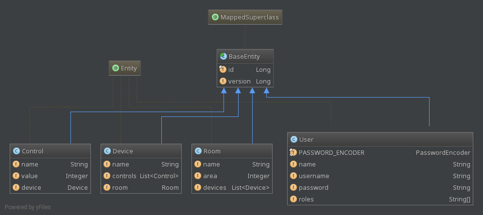

# Techdegree project 10
### REST API with Spring: Home Automation

### Table of Contents
### Installation instructions
* [Eclipse installation instructions.] (#eclipse)

### Misc
- [Quick Links to files and directories] (#links)
- [Notes about project] (#notes)

### Tasks
* [1.] (#task-1)
    Create a Spring Data REST project to serve the HATEOAS compliant API. 
    Use the Spring Boot Gradle plugin for your dependencies.
    

* [2.] (#task-2)
    Build entities and relationships between Room, Device, Control, and User 
    based on the included diagram.
    

* [3.] (#task-3)
    Build repositories that can be paged and sorted 
    for each of the entities.
    

* [4.] (#task-4)
    Expose the API under /api/v1/
    

* [5.] (#task-5)
    Secure the API so that only authenticated users can view details
    

* [6.] (#task-6)
    Ensure that the users repository is not exported
    

* [7.] (#task-7)
    Secure the API so that only users with the ROLE_ADMIN role 
    can create rooms
    

* [8.] (#task-8)
    Validate that room’s area is less than 1000 (sq ft/sq meters) 
    and ensure friendly JSON messages are returned to the caller.
    

* [9.] (#task-9)
    Create documentation that is exposed in 
    Hypermedia Application Language (HAL) for the Room.area 
    field for fellow developers who will use your API 
    that explain that the value should represent either 
    square meters or square footage depending on your units of measure.
* [10.] (#task-10)
    Add a search resource that provides the ability 
    to find Devices based on a partial name.
    

* [11.] (#task-11)
    Track the last user to modify the control 
    and report it in control.lastModifiedBy
    

* [12.] (#task-12)
    Ensure that control modifications are versioned so 
    that clients can use appropriate E-Tags
    

* [13.] (#task-13)
    Add tests to validate all requested additional configuration
    

* [14.] (#task-14)
    Add additional searches to find rooms by name and 
    by less than a specified area
    

* [15.] (#task-15)
    Ensure that only Room Administrators can 
    add and modify Devices and Controls.
    

    

<!--Links-->

<!--External Links-->

<!--Properties files-->
[build.gradle]:
    ./build.gradle "Gradle configuration file: build.gradle"
[application.properties]:
    ./src/main/resources/application.properties "Spring Application properties file ./src/main/resources/application.properties"
[rest-messages.properties]:
    ./src/main/resources/rest-messages.properties "File w REST messages, describing our API ./src/main/resources/rest-messages.properties"

<!--Misc-->
<!--
    [model_classes_relationship_diagram.png]:
    ./misc/model_classes_relationship_diagram.png "./misc/model_classes_relationship_diagram.png"
 -->

<!--Java Classes-->
[ApplicationIntegrationTest]:
    ./src/test/java/com/teamtreehouse/home/ApplicationIntegrationTest.java "./src/test/java/com/teamtreehouse/home/ApplicationIntegrationTest.java"
[DeviceDaoTest]:
    ./src/test/java/com/teamtreehouse/home/dao/DeviceDaoTest.java "./src/test/java/com/teamtreehouse/home/dao/DeviceDaoTest.java"
[ControlDaoTest]:
    ./src/test/java/com/teamtreehouse/home/dao/ControlDaoTest.java "./src/test/java/com/teamtreehouse/home/dao/ControlDaoTest.java"
[RoomDaoTest]:
    ./src/test/java/com/teamtreehouse/home/dao/RoomDaoTest.java "./src/test/java/com/teamtreehouse/home/dao/RoomDaoTest.java"
    
[CustomUserDetailsService]:
    ./src/main/java/com/teamtreehouse/home/service/CustomUserDetailsService.java "./src/main/java/com/teamtreehouse/home/service/CustomUserDetailsService.java"
[ControlEventHandler]:
    ./src/main/java/com/teamtreehouse/home/handler/ControlEventHandler.java "./src/main/java/com/teamtreehouse/home/handler/ControlEventHandler.java"
[Application]:
    ./src/main/java/com/teamtreehouse/home/Application.java "./src/main/java/com/teamtreehouse/home/Application.java"
[BaseEntity]:
    ./src/main/java/com/teamtreehouse/home/model/BaseEntity.java "./src/main/java/com/teamtreehouse/home/model/BaseEntity.java"
[Device]:
    ./src/main/java/com/teamtreehouse/home/model/Device.java "./src/main/java/com/teamtreehouse/home/model/Device.java"
[Control]:
    ./src/main/java/com/teamtreehouse/home/model/Control.java "./src/main/java/com/teamtreehouse/home/model/Control.java"
[User]:
    ./src/main/java/com/teamtreehouse/home/model/User.java "./src/main/java/com/teamtreehouse/home/model/User.java"
[Room]:
    ./src/main/java/com/teamtreehouse/home/model/Room.java "./src/main/java/com/teamtreehouse/home/model/Room.java"
[DataLoader]:
    ./src/main/java/com/teamtreehouse/home/DataLoader.java "./src/main/java/com/teamtreehouse/home/DataLoader.java"
[ControlDao]:
    ./src/main/java/com/teamtreehouse/home/dao/ControlDao.java "./src/main/java/com/teamtreehouse/home/dao/ControlDao.java"
[DeviceDao]:
    ./src/main/java/com/teamtreehouse/home/dao/DeviceDao.java "./src/main/java/com/teamtreehouse/home/dao/DeviceDao.java"
[UserDao]:
    ./src/main/java/com/teamtreehouse/home/dao/UserDao.java "./src/main/java/com/teamtreehouse/home/dao/UserDao.java"
[RoomDao]:
    ./src/main/java/com/teamtreehouse/home/dao/RoomDao.java "./src/main/java/com/teamtreehouse/home/dao/RoomDao.java"
[RestConfig]:
    ./src/main/java/com/teamtreehouse/home/config/RestConfig.java "./src/main/java/com/teamtreehouse/home/config/RestConfig.java"
[WebSecurityConfiguration]:
    ./src/main/java/com/teamtreehouse/home/config/WebSecurityConfiguration.java "./src/main/java/com/teamtreehouse/home/config/WebSecurityConfiguration.java"

### Eclipse Installation instructions

 
For the first time I decided not to export project to 
Eclipse, because it seems that `apply plugin: 'eclipse'` 
in [build.gradle] is enough for Gradle to generate
all necessary files. I tried and it worked like Charm.

### Tasks
1. 
    Create a Spring Data REST project to serve the HATEOAS compliant API. 
    Use the Spring Boot Gradle plugin for your dependencies.
    

    Created Spring Data REST project, added following dependencies for
    the project to be HATEOAS compliant:
    - `org.springframework.boot:spring-boot-starter-data-rest`
       : main spring data rest dependecy
    - `org.springframework.boot:spring-boot-starter-data-jpa`:
       Spring Data JPA repositories dependency
    - `org.springframework.data:spring-data-rest-hal-browser`:
      HAL browser dependency

    [Application] runs with @SpringBootApplication annotation to
    ensure proper REST api auto configuration

2. 
    Build entities and relationships between Room, Device, Control, and User 
    based on the included diagram.
    

    Entities were built according to diagram, see 
    UML diagram 
    

3. 
    Build repositories that can be paged and sorted 
    for each of the entities.
    

    All repositories except from [UserDao] 
    are paged and sorted, i.e. *extend* 
    `PagingAndSortingRepository` from Spring Data:
    - [RoomDao]
    - [DeviceDao]
    - [ControlDao]

    [UserDao] *extends* `CrudRepository` because it is
    not REST exposed, so there is no need for it to
    be paged and/or sorted.

4. 
    Expose the API under /api/v1/
    

    Property `spring.data.rest.basePath` is set to `/api/v1` in
    [application.properties] file.

5. 
    Secure the API so that only authenticated users can 
    view details.
    

    1. Dependency 
    `org.springframework.boot:spring-boot-starter-security`
    is added to [build.gradle].
    2. [WebSecurityConfiguration] file configures security
    for our API. `configure` method ensures that every 
    request has to be authenticated with basic authentication.

6. 
    Ensure that the users repository is not exported
    

    [UserDao] is marked with `@RepositoryRestResource(exported = false)`
    and thus is not exposed to REST API.

7. 
    Secure the API so that only users with the ROLE_ADMIN role 
    can create rooms
    

    I added responsible @PreAuthorize annotation on top of
    `save` method in [RoomDao], that will check that user has
    'ROLE_ADMIN' before saving. In order to create room
    just like @craigsdennis does in Workshop using
    [DataLoader] `ApplicationRunner` class, I also
    added needed dependecy and authorized admin user in
    [DataLoader] to create couple of test rooms.
    

    I was not able to test this functionality properly.
    I can test that if user with "ROLE_ADMIN" creates
    room his request passes, see 
    `postMethodCreatingNewRoomShouldWorkWithAdminUser`
    in [ApplicationIntegrationTest]. 
     
    Test trying to model situation where user with
    "ROLE_USER" is trying to create room, throws
    `NestedServletException` with nested 
    `AccessDeniedException` and not nice JSON with
    403 Error. And I don't know workaround. So I have test,
    that is trying to check that:
    `postMethodCreatingNewRoomShouldReturnAccessDeniedWithNormalUser`
    But it does not work properly. 

8. <a id="task-8"><a/>
    Validate that room’s area is less than 1000 (sq ft/sq meters) 
    and ensure friendly JSON messages are returned to the caller.
    

    - In the [Room] class @Max annotation was added with 
    friendly message.
    - In the [RestConfig] class `ValidatingListener` was added to
    to "beforeSave" and "beforeCreate" events, so that when any 
    device, control or room are created and validation fails, 
    messages will be returned with JSON to user.
    

    Testing this in 
    `postMethodCreatingNewRoomWithBigAreaShouldReturnFriendlyError`
    in [ApplicationIntegrationTest].

9. <a id="task-9"><a/>
    Create documentation that is exposed in 
    Hypermedia Application Language (HAL) for the Room.area 
    field for fellow developers who will use your API 
    that explain that the value should represent either 
    square meters or square footage depending on your units of measure.
    

    I've added [rest-messages.properties] file w descriptions to 
    all fields of room, device and control.

10. <a id="task-10"><a/>
    Add a search resource that provides the ability 
    to find Devices based on a partial name.
    

    In [DeviceDao] `findByNameContaining` Spring Query method is
    defined. The implementation will be provided by Spring Data.
     
    `@RestResource(rel = "name", path = "contains-name")`
    annotation is added to make the following query 
    available in browser:
    `BASE_URL/devices/search/contains-name?name=query`
    Where BASE_URL can be `localhost:8080/api/v1`, and
    "query" can be device name that we are looking for.
    

    This query is tested in `devicesCanBeSearchedByNameContaining()`
    test method in [ApplicationIntegrationTest]. 

11. <a id="task-11"><a/>
    Track the last user to modify the control 
    and report it in control.lastModifiedBy
    

    For that purpose [ControlEventHandler] class was introduced
    marked with `@RepositoryEventHandler(Control.class` and
    handling @HandleBeforeCreate and @HandleBeforeSave events.
    When [Control] is saved or created, currently logged on
    user is added to `Control.lastModifiedBy` field.
     
    Currently `Control.lastModifiedBy` is in @ManyToOne 
    relationship with [User]. Hope its right.
    

    Test checking this is method called:
    `afterCreationLoggedOnUserIsSetToLastModifiedByFieldInControl()`
    in [ApplicationIntegrationTest].    

12. <a id="task-12"><a/>
    Ensure that control modifications are versioned 
    so that clients can use appropriate E-Tags.
    

    All Model classes [Control], [Device] and [Room] 
    are versioned, because they extend [BaseEntity]
    that has `private` field annotated with 
    @Version.
    

    Test checking "Etag" header for room detail
    page is situated in
    [ApplicationIntegrationTest] and is called:
    `roomDetailPageShouldHaveEtagHeader()`

### Extra Credit
13. <a id="task-13"><a/>
    Add tests to validate all requested additional configuration
    

    [DeviceDao] tests in [DeviceDaoTest]:
    - `devicesCanBeSearchedByNameContaining`
    - `devicesCanBeSavedByAdminUsers`
    - `devicesCannotBeSavedByNonAdminNonRoomAdminUsers`
    

    [RoomDao] tests in [RoomDaoTest]:
    - `userWithAdminRoleCanCreateRoom`
    - `userWithSimpleRoleCannotCreateRoom`
    - `roomsCanBeSearchedByName`
    - `roomsCanBeSearchedByAreaLessThan`
    

    [ControlDao] tests in [ControlDaoTest]:
    - `controlsCannotBeSavedByNonAdminsNonRoomAdmins`
    - `controlsCanBeSavedByAdmin`
    

    Integration tests (or functional I guess) are available
    in [ApplicationIntegrationTest] and are called:
    - *Room* tests
        - `getRequestToRoomsPageReturnsTwoRooms`
        - `roomDetailPageShouldHaveEtagHeader`
        - `roomsCanBeSearchedByName`
        - `roomsCanBeSearchedByAreaLessThan`
        - `postMethodCreatingNewRoomShouldWorkWithAdminUser`
        - `postMethodCreatingNewRoomShouldReturnAccessDeniedWithNormalUser`
        - `postMethodCreatingNewRoomWithBigAreaShouldReturnFriendlyError`
    - *Device* tests
        - `devicesCanBeSearchedByNameContaining`
        - `postMethodCreatingNewDeviceShouldWorkWithAdminUser`
        - `creatingDeviceWithoutRoomReturnsValidationMessage`
        - `creatingDeviceWithNonAdminAndNonRoomAdminUserShouldThrowAccessDeniedException`
    - *Control* tests
        - `postMethodCreatingNewControlShouldWorkWithAdminUser`
        - `creatingControlWithoutDeviceReturnsValidationMessage`
        - `afterCreationLoggedOnUserIsSetToLastModifiedByFieldInControl`
        - `creatingControlWithNonAdminAndNonRoomAdminUserShouldThrowAccessDeniedException`

14. <a id="task-14"><a/>
    Add additional searches to find rooms by name and 
    by less than a specified area
    

    In [RoomDao] Spring query method was introduced:
    `findByAreaLessThan` and `findByName`. They 
    make following GET requests available:
    - `BASE_URL/rooms/search/has-area-less-than/?area=1`
    - `BASE_URL/rooms/search/has-name/?name=name`
    

    The functionality is tested in 
    - `roomsCanBeSearchedByName` in [RoomDaoTest]
    - `roomsCanBeSearchedByAreaLessThan` in [RoomDaoTest]
    - `roomsCanBeSearchedByAreaLessThan` in [ApplicationIntegrationTest]
    - `roomsCanBeSearchedByName` in [ApplicationIntegrationTest]

15. <a id="task-15"><a/>
    Ensure that only Room Administrators can 
    add and modify Devices and Controls.
    

    Method `save` in [DeviceDao] is `@Override`-n with Spring
    Security `@PreAuthorize` annotation so that only
    user with "ROLE_ADMIN" and `device.room.adminstrators` 
    can save Device.
    

    Analogously, method `save` in [ControlDao] is `@Override`-n
    with @PreAuthorize so that only user with "ROLE_ADMIN" and
    `control.device.room.administrators` can save Control.
    

    Tests checking this in [DeviceDaoTest] are:
    - `devicesCanBeSavedByAdminUsers`
    - `devicesCannotBeSavedByNonAdminNonRoomAdminUsers`
    

    Tests checking this in [ControlDaoTest] are:
    - `controlsCanBeSavedByAdmin`
    - `controlsCannotBeSavedByNonAdminsNonRoomAdmins`
    

    Test checking this in [ApplicationIntegrationTest] are:
    - `postMethodCreatingNewDeviceShouldWorkWithAdminUser`
    - `creatingDeviceWithNonAdminAndNonRoomAdminUserShouldThrowAccessDeniedException`
    - `postMethodCreatingNewControlShouldWorkWithAdminUser`
    - `creatingControlWithNonAdminAndNonRoomAdminUserShouldThrowAccessDeniedException`

### Notes about project 
- `bootRun` gradle task is used to run the App.
- [DataLoader] class loads in system: 
    - "jd" user with "ROLE_USER", and password "123"
    - "sa" user with "ROLE_ADMIN", password: "sa"
    - two rooms with two devices each created by
      "sa" user, making "sa" user 
      as one of the `room.administrators`
    - two devices with two controls each created by "sa"
    - `control.lastModifiedBy` user is also "sa"
- [DataLoader] class is used for easier check of 
  functionality, and it is also used in all tests,
  but the difference is that in each test I had
  to create different in-memory database that is
  `drop-create`-d every time tests run. Actual `bootRun`
  is attached to [home.mv.db] database in [data]
  directory, so that tests and real App are separated

### Links 

### Properties files
- [build.gradle]
- [application.properties]
- [rest-messages.properties]

### Java Classes

#### Tests
- [ApplicationIntegrationTest]
- [DeviceDaoTest]
- [ControlDaoTest]
- [RoomDaoTest]

#### Model/Domain
- [BaseEntity]
- [Device]
- [Control]
- [User]
- [Room]

#### DAO
- [ControlDao]
- [DeviceDao]
- [UserDao]
- [RoomDao]

#### Configuration
- [RestConfig]

#### Misc
- [CustomUserDetailsService]
- [ControlEventHandler]
- [Application]
- [DataLoader]

